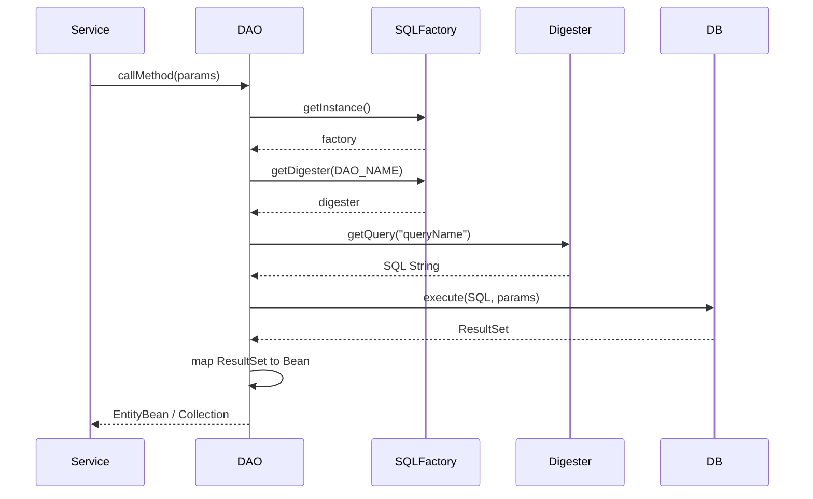
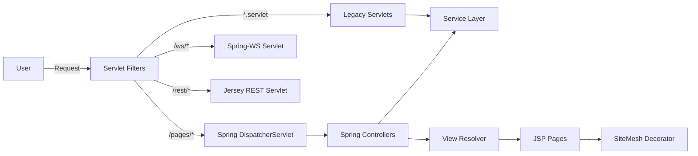
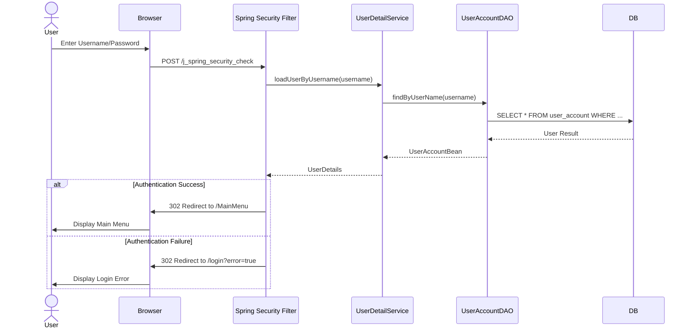
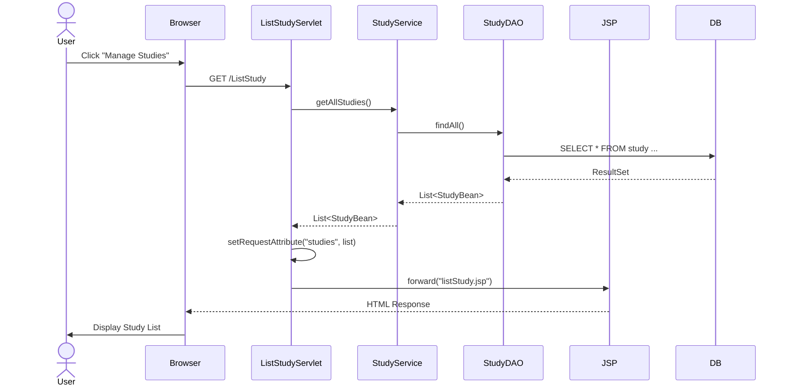

# OpenClinica System Documentation

## 1. Overview

OpenClinica is an open-source software for Electronic Data Capture (EDC) and Clinical Data Management (CDM). It is designed to optimize clinical trial workflows, ensuring secure and efficient data collection and management.

Key features include:
- Study build and eCRF creation.
- Rule design and edit checks.
- Patient visit scheduling.
- Web-based data capture.
- Clinical data monitoring and management.
- Audit trails and electronic signatures.
- Role-based access controls.
- Data import/export.

## 2. System Architecture

OpenClinica follows a multi-tier architecture, typically deployed on a Java Application Server (like Tomcat) with a relational database backend (PostgreSQL or Oracle).

### High-Level Architecture

```mermaid
graph TD
    Client[Web Browser / Client] -->|HTTP/HTTPS| LoadBalancer[Load Balancer / Proxy]
    LoadBalancer -->|HTTP| AppServer[Application Server (Tomcat)]

    subgraph AppServer
        WebMod[Web Module]
        WSMod[WS Module]
        CoreMod[Core Module]

        WebMod --> CoreMod
        WSMod --> CoreMod
    end

    CoreMod -->|JDBC/Hibernate| DB[(Database)]
    CoreMod -->|SMTP| Email[Email Server]
    CoreMod -->|File I/O| FileSys[File System]
```

### Module Breakdown

The project is organized as a multi-module Maven project:

1.  **`core`**: Contains the business logic, data access layer, domain models, and core infrastructure. It is the heart of the application.
2.  **`web`**: Contains the web application layer, including Servlets, Spring MVC Controllers, JSPs, and web configurations. It depends on `core`.
3.  **`ws`**: Contains Web Services (SOAP) endpoints for external integrations. It depends on `core` (and likely shares some web infrastructure).

## 3. Technology Stack

- **Language**: Java
- **Build Tool**: Maven
- **Web Frameworks**:
    - Spring MVC
    - Legacy Java Servlets
    - Jersey (REST)
    - Spring Web Services (SOAP)
    - SiteMesh (Layout/Templating)
    - JSP (View Technology)
- **Core Frameworks**:
    - Spring Framework (DI, AOP, TX, Security)
    - Quartz (Job Scheduling)
- **Persistence**:
    - Custom DAO Framework (JDBC based)
    - Hibernate (for some parts)
    - Liquibase (Database Migrations)
- **Database**: PostgreSQL / Oracle
- **Logging**: SLF4J / Logback
- **Testing**: JUnit, DBUnit

## 4. Core Module

The `core` module (`core/src/main/java`) encapsulates the domain model and business rules.

### Data Access Layer (DAO)

OpenClinica uses a custom Data Access Object (DAO) framework alongside Spring JDBC and Hibernate.

#### Key Components:
1.  **`AuditableEntityDAO`**: A base class for many DAOs. It provides common functionality for auditing changes to entities.
2.  **`SQLFactory`**: A singleton class responsible for loading SQL queries from XML configuration files.
    -   It detects the database type (Oracle/PostgreSQL).
    -   It loads properties/XML files containing named queries.
3.  **`DAODigester`**: A utility used by `SQLFactory` to parse the XML files and store queries in a map.
4.  **`EntityBean`**: The base class for domain objects (POJOs) that map to database tables.

#### DAO Pattern Flow:



### Domain Model

The domain model resides mainly in `org.akaza.openclinica.bean`.

-   **`login.UserAccountBean`**: Represents a system user.
-   **`managestudy.StudyBean`**: Represents a clinical study or site.
-   **`managestudy.StudySubjectBean`**: Represents a subject enrolled in a study.
-   **`submit.EventCRFBean`**: Represents a Case Report Form (CRF) event for a subject.

### Service Layer

The service layer (`org.akaza.openclinica.service`) orchestrates business logic.

-   **`user.UserService`**: User management.
-   **`managestudy.StudyService`**: Study configuration and management.
-   **`subject.SubjectService`**: Subject management.
-   **`rule.RuleService`**: Execution of edit checks and rules.

## 5. Web Module

The `web` module (`web/src/main/webapp`) implements the user interface and handles HTTP requests. It uses a hybrid approach combining legacy Servlets and Spring MVC.

### Architecture



### Request Handling

1.  **Filters**: All requests pass through a chain of filters defined in `web.xml`.
    -   `springSecurityFilterChain`: Handles authentication and authorization.
    -   `hibernateFilter`: Open Session In View pattern.
    -   `localeFilter`: Sets up internationalization.
    -   `sitemesh`: Decorates the response with the standard layout.

2.  **Legacy Servlets**: Many core functions (e.g., `SubmitDataServlet`, `MainMenuServlet`) are implemented as standard Java Servlets extending `HttpServlet`. They interact directly with DAOs or Services.

3.  **Spring MVC**: Newer features use Spring MVC `@Controller` classes. They are mapped under the `/pages/` URL pattern.

4.  **View Layer**:
    -   **JSP**: JavaServer Pages are used for rendering HTML.
    -   **SiteMesh**: Used for page layout (headers, footers, navigation).

### Security

OpenClinica uses **Spring Security** for authentication and authorization.
-   Configuration is found in `applicationContext-security.xml`.
-   It supports form-based login (`/pages/login`).
-   Role-based access control is enforced at the URL and method level.

## 6. Web Services (WS)

OpenClinica exposes APIs for integration with external systems.

### SOAP Web Services
Implemented in the `ws` module using **Spring-WS**.
-   **URL**: `/ws/*`
-   **Endpoints**:
    -   `StudyEndpoint`: Manage studies.
    -   `SubjectEndpoint`: Manage subjects.
    -   `EventEndpoint`: Manage study events.
    -   `DataEndpoint`: Submit clinical data (ODM format).
-   **WSDL**: Schemas are defined in `xsd` files and exposed via WSDL.

### RESTful Web Services
Implemented in the `web` module using **Jersey (JAX-RS)**.
-   **URL**: `/rest/*` and `/rest2/*`
-   **Functionality**:
    -   Retrieve study metadata (ODM).
    -   Import/Export data.
    -   User management.
-   **Authentication**: Typically uses Basic Auth or API Key.

## 7. Database & Persistence

### Configuration
Database configuration is managed via `datainfo.properties` (or similar properties files) and Spring's `dataSource` bean.

### Custom SQL Loading Mechanism
Unlike standard ORMs that might use annotations or XML mapping files for everything, OpenClinica uses a custom mechanism to externalize SQL queries.

1.  **`SQLFactory`**:
    -   Starts up and reads `ehcache.xml` (for caching).
    -   Determines the DB type.
    -   Loads a list of XML files (e.g., `oracle_useraccount_dao.xml` or `useraccount_dao.xml` for Postgres) into memory.

2.  **`DAODigester`**:
    -   Parses the XML files.
    -   Extracts SQL queries keyed by name (e.g., `findByPK`, `findAll`).

3.  **Execution**:
    -   DAOs request the query string from the Digester by name.
    -   The query is executed using `JdbcTemplate` or `NamedParameterJdbcTemplate` logic (wrapped in `AuditableEntityDAO`).

### Database Migrations
**Liquibase** is used for database version control.
-   Changelogs are stored in `src/main/resources`.
-   Liquibase runs on startup to apply pending schema changes.

## 8. Sequence Diagrams

### 8.1 User Login Flow (Simplified)



### 8.2 View Study List Flow


