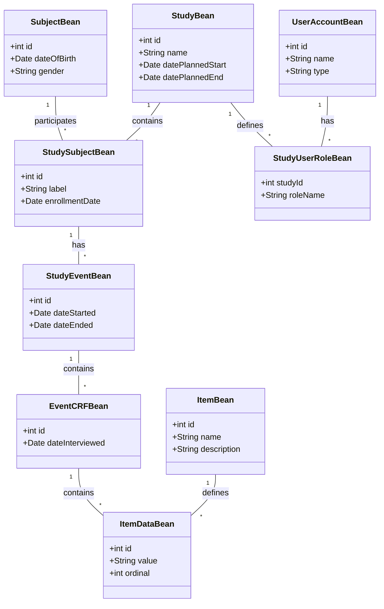
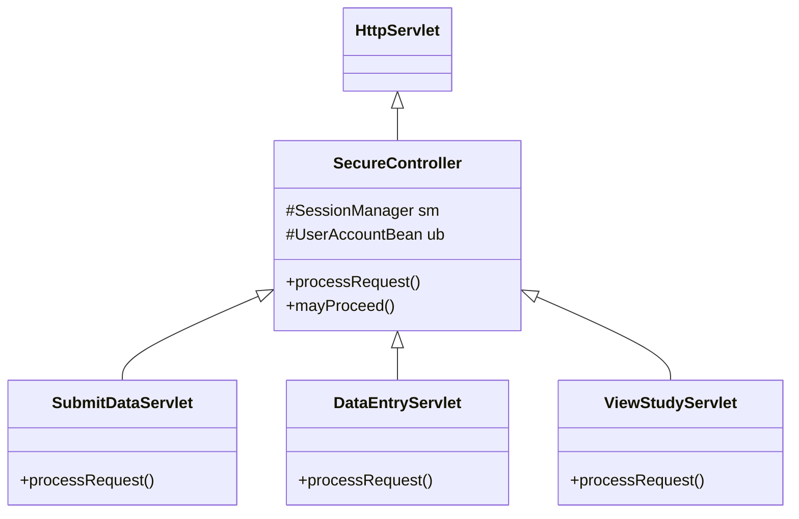
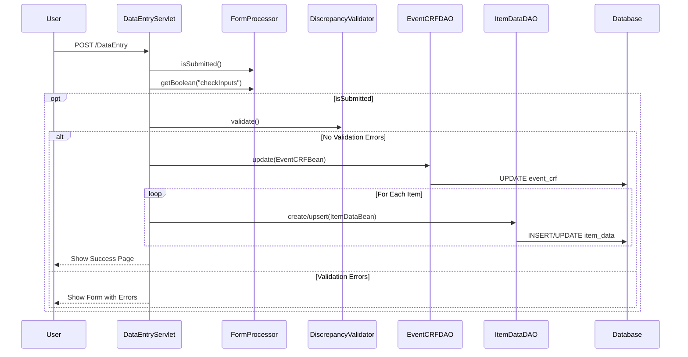

# OpenClinica Codebase Documentation

## Overview
OpenClinica is an open-source software for Electronic Data Capture (EDC) and Clinical Data Management (CDM). It is a Java-based application built using Maven, Spring Framework, Hibernate, and other technologies.

## Architecture
The project is a multi-module Maven project consisting of three main modules:
- **core**: Contains the business logic, data model, DAOs, and service layer.
- **web**: Contains the web application (Servlets, JSPs, Controllers) and UI logic.
- **ws**: Contains the Web Services (SOAP/REST) for external integration.

### High-Level Architecture Diagram
```mermaid
graph TD
    User[User/Browser] --> WebApp[Web Application (web)]
    ExtSys[External System] --> WS[Web Services (ws)]

    subgraph "OpenClinica Application"
        WebApp --> Core[Core Module (core)]
        WS --> Core

        subgraph "Core Module"
            Service[Service Layer]
            DAO[DAO Layer]
            Domain[Domain Model]
        end

        Core --> DB[(Database)]
    end
```

## Data Model
The core data model revolves around Studies, Subjects, Events, and CRFs (Case Report Forms).

### Key Entities
- **Study**: Represents a clinical study or a site within a study.
- **Subject**: A participant in a study.
- **StudySubject**: The association between a Study and a Subject.
- **StudyEvent**: An event that occurs for a subject in a study (e.g., "Visit 1").
- **EventCRF**: A specific CRF filled out for a study event.
- **Item**: A question or data point in a CRF.
- **ItemData**: The actual answer or value provided for an Item.
- **UserAccount**: Represents a system user.
- **StudyUserRole**: Represents the role of a user within a specific study.

### Class Diagram


## Web Layer
The web layer is primarily built on top of the Servlet API, with a custom MVC framework.

### SecureController
The `SecureController` class extends `HttpServlet` and serves as the base class for most controllers in the application. It handles:
- Authentication and Authorization
- Session Management (via `SessionManager`)
- Localization (via `LocaleResolver`)
- Request Processing (via abstract `processRequest` method)



## Web Services
The `ws` module provides endpoints for external systems to interact with OpenClinica. It uses Spring Web Services.

### Key Components
- **StudyEndpoint**: Handles study-related requests. Uses `StudyDAO` to fetch data and `MetaDataCollector` to generate ODM XML.
- **StudyMetadataRequestValidator**: Validates incoming requests.

## Sequence Flows

### Data Submission Flow (DataEntryServlet)
This diagram illustrates how data submission is handled in the application, specifically within the `DataEntryServlet` hierarchy.


