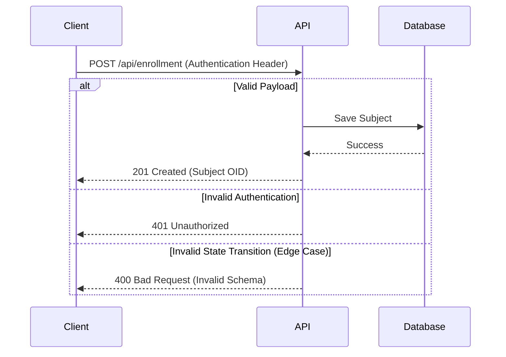

# Subject Enrollment Guide

This guide describes how to automate subject enrollment using the OpenRosa API.

## Sequence Diagram



## Runnable Payload

You can use the following JSON payload to test subject enrollment. Note: all identifiers and names are fictitious.

```json
{
  "subject": {
    "study_oid": "S_FICT01",
    "subject_id": "SUB-9999",
    "enrollment_date": "2023-10-01",
    "gender": "F",
    "date_of_birth": "1980-05-15",
    "person_id": "F-883921"
  }
}
```

## Response Payload

```json
{
  "status": "success",
  "subject_oid": "SS_SUB9999",
  "message": "Subject enrolled successfully"
}
```
