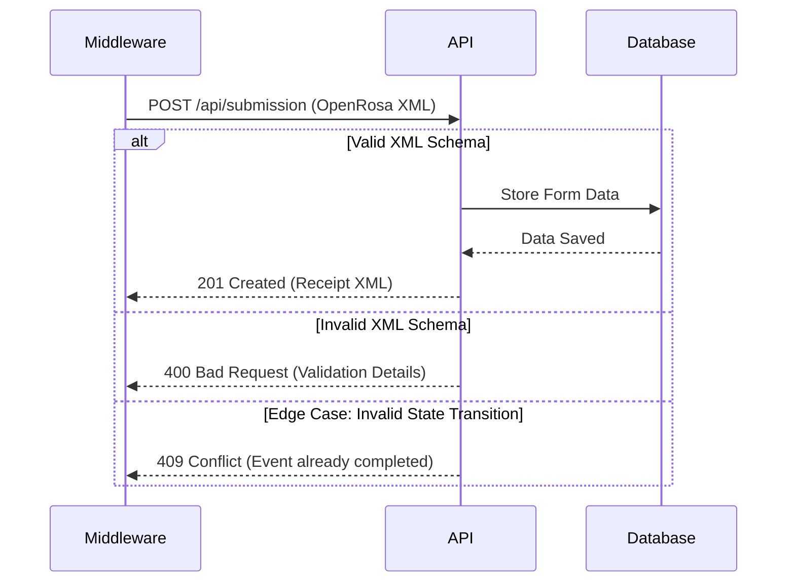

# Form Data Ingestion Guide

This guide describes how to robustly handle API errors during high-volume form ingestion using OpenRosa payloads.

## Sequence Diagram



## Runnable Payload

The following is a fictitious OpenRosa form submission XML payload.

```xml
<data id="fictitious_baseline_form">
    <subject_oid>SS_SUB9999</subject_oid>
    <event_oid>SE_BASELINE_1</event_oid>
    <demographics>
        <weight>70.5</weight>
        <height>175</height>
    </demographics>
    <meta>
        <instanceID>uuid:12345678-1234-1234-1234-123456789abc</instanceID>
    </meta>
</data>
```

## Error Handling Response (Schema)

When handling invalid state transitions or validation edge cases, expect a response structured as follows:

```xml
<OpenRosaResponse xmlns="http://openrosa.org/http/response">
    <message nature="error">Validation Failed: The form data does not match the expected event state.</message>
    <errorDetails>
        <conflict>Event SE_BASELINE_1 is already completed.</conflict>
    </errorDetails>
</OpenRosaResponse>
```
