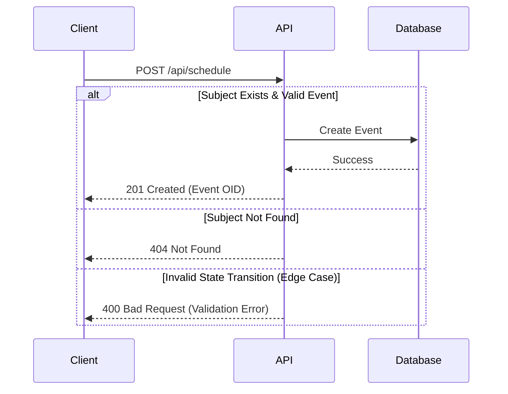

# Event Scheduling Guide

This guide details how to schedule study events for enrolled subjects.

## Sequence Diagram



## Runnable Payload

The following JSON payload illustrates how to schedule an event. All dates and identifiers are fictitious.

```json
{
  "schedule": {
    "subject_oid": "SS_SUB9999",
    "event_oid": "SE_BASELINE",
    "start_date": "2023-10-02",
    "end_date": "2023-10-02",
    "location": "Fictitious Clinic A"
  }
}
```

## Response Payload

```json
{
  "status": "success",
  "study_event_oid": "SE_BASELINE_1",
  "message": "Event scheduled successfully"
}
```
