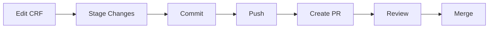

# Git-Based CRF Versioning Strategy

## Overview

This document describes how to use Git as the version control system for CRF definitions, enabling proper versioning, branching, merging, and collaboration.

---

## Table of Contents
1. [Why Git for CRF Versioning](#why-git-for-crf-versioning)
2. [CRF Storage Format](#crf-storage-format)
3. [Git Workflow](#git-workflow)
4. [Branching Strategy](#branching-strategy)
5. [Versioning Scheme](#versioning-scheme)
6. [Merge Strategies](#merge-strategies)
7. [Implementation](#implementation)

---

## Why Git for CRF Versioning

### Benefits
1. **Complete History** - Every change tracked with author, timestamp, and message
2. **Branching** - Work on multiple versions simultaneously
3. **Merging** - Intelligent conflict resolution
4. **Collaboration** - Multiple designers can work in parallel
5. **Rollback** - Easy to revert to any previous version
6. **Comparison** - Built-in diff tools show exact changes
7. **Proven Technology** - Industry-standard version control

### Traditional vs Git-Based

| Aspect | Traditional | Git-Based |
|--------|------------|-----------|
| **Storage** | Database BLOB | Git repository |
| **History** | Manual versioning | Automatic commits |
| **Collaboration** | Lock-based | Merge-based |
| **Branching** | Manual copies | Git branches |
| **Comparison** | Custom diff logic | Git diff |
| **Rollback** | Complex | `git revert` |

---

## CRF Storage Format

### JSON Format
Store CRFs as JSON files for Git-friendly versioning.

```json
// crfs/demographics.json
{
  "metadata": {
    "id": "crf_demographics_v1",
    "name": "Demographics",
    "description": "Patient demographics form",
    "version": "1.0.0",
    "status": "draft",
    "createdAt": "2026-02-03T12:00:00Z",
    "updatedAt": "2026-02-03T12:00:00Z",
    "author": "designer@example.com"
  },
  "sections": [
    {
      "id": "section_personal",
      "label": "PERSONAL_INFO",
      "title": "Personal Information",
      "ordinal": 1,
      "items": [
        {
          "id": "item_age",
          "name": "AGE",
          "label": "Age",
          "type": "number",
          "required": true,
          "validation": {
            "min": 0,
            "max": 120
          }
        },
        {
          "id": "item_gender",
          "name": "GENDER",
          "label": "Gender",
          "type": "select",
          "required": true,
          "options": [
            { "value": "M", "label": "Male" },
            { "value": "F", "label": "Female" },
            { "value": "O", "label": "Other" }
          ]
        }
      ]
    }
  ]
}
```

### Directory Structure

```
crf-repository/
├── .git/                      # Git repository
├── crfs/                      # CRF definitions
│   ├── demographics.json
│   ├── vital-signs.json
│   ├── medical-history.json
│   └── adverse-events.json
├── templates/                 # CRF templates
│   └── basic-template.json
├── schemas/                   # JSON schemas for validation
│   └── crf-schema.json
├── visit-configs/             # Visit grid configurations
│   └── study-001.json
└── README.md                  # Repository documentation
```

---

## Git Workflow

### Basic Workflow



### Commands

```bash
# 1. Clone repository
git clone https://github.com/org/crf-repository.git
cd crf-repository

# 2. Create feature branch
git checkout -b feature/add-demographics-section

# 3. Edit CRF
# (Use CRF Design Studio to edit crfs/demographics.json)

# 4. Check status
git status

# 5. View changes
git diff crfs/demographics.json

# 6. Stage changes
git add crfs/demographics.json

# 7. Commit with descriptive message
git commit -m "feat(demographics): add ethnicity field

- Added ethnicity field to demographics CRF
- Type: multi-select
- Options: Hispanic, Non-Hispanic, Unknown
- Required: true"

# 8. Push to remote
git push origin feature/add-demographics-section

# 9. Create pull request (via GitHub/GitLab)

# 10. After review and approval, merge
git checkout main
git pull origin main
git merge feature/add-demographics-section
git push origin main
```

---

## Branching Strategy

### Git Flow for CRFs

```
main (production)
  ├─ develop (integration)
  │   ├─ feature/add-new-field
  │   ├─ feature/add-validation
  │   └─ feature/update-section
  ├─ release/v2.0.0
  └─ hotfix/fix-validation-bug
```

### Branch Types

#### 1. Main Branch
- **Purpose**: Production-ready CRFs
- **Protected**: Yes
- **Requires PR**: Yes
- **Naming**: `main`

#### 2. Develop Branch
- **Purpose**: Integration branch for features
- **Protected**: Yes
- **Naming**: `develop`

#### 3. Feature Branches
- **Purpose**: New features or modifications
- **Naming**: `feature/<description>`
- **Base**: `develop`
- **Example**: `feature/add-ethnicity-field`

```bash
git checkout develop
git checkout -b feature/add-ethnicity-field
# Make changes
git commit -m "feat: add ethnicity field"
git push origin feature/add-ethnicity-field
# Create PR to develop
```

#### 4. Release Branches
- **Purpose**: Prepare for production release
- **Naming**: `release/v<version>`
- **Base**: `develop`
- **Merge to**: `main` and `develop`

```bash
git checkout develop
git checkout -b release/v2.0.0
# Finalize, test, update version
git commit -m "chore: bump version to 2.0.0"
git checkout main
git merge release/v2.0.0
git tag v2.0.0
git checkout develop
git merge release/v2.0.0
```

#### 5. Hotfix Branches
- **Purpose**: Emergency fixes
- **Naming**: `hotfix/<description>`
- **Base**: `main`
- **Merge to**: `main` and `develop`

```bash
git checkout main
git checkout -b hotfix/fix-validation
# Fix issue
git commit -m "fix: correct age validation range"
git checkout main
git merge hotfix/fix-validation
git tag v2.0.1
git checkout develop
git merge hotfix/fix-validation
```

---

## Versioning Scheme

### Semantic Versioning (SemVer)

**Format**: `MAJOR.MINOR.PATCH`

```
1.0.0 → Initial version
1.1.0 → Added new field (backward compatible)
1.1.1 → Fixed validation bug
2.0.0 → Breaking change (removed field)
```

### Rules

**MAJOR** - Increment when:
- Removing fields
- Changing field types
- Breaking backward compatibility

**MINOR** - Increment when:
- Adding new fields
- Adding new sections
- Adding new validation rules

**PATCH** - Increment when:
- Fixing bugs
- Updating descriptions
- Fixing validation logic

### Version Tags

```bash
# Create version tag
git tag -a v1.0.0 -m "Release version 1.0.0"

# Push tag
git push origin v1.0.0

# List tags
git tag

# Checkout specific version
git checkout v1.0.0
```

### Version in CRF File

```json
{
  "metadata": {
    "version": "1.2.3",
    "gitCommit": "abc123def",
    "gitTag": "v1.2.3"
  }
}
```

---

## Merge Strategies

### Automatic Merge
Git can automatically merge non-conflicting changes.

```json
// Version A (base)
{
  "items": [
    { "id": "item_age", "name": "AGE" }
  ]
}

// Version B (feature-1)
{
  "items": [
    { "id": "item_age", "name": "AGE" },
    { "id": "item_gender", "name": "GENDER" }  // Added
  ]
}

// Version C (feature-2)
{
  "items": [
    { "id": "item_age", "name": "AGE" },
    { "id": "item_dob", "name": "DOB" }  // Added
  ]
}

// Merged (automatic)
{
  "items": [
    { "id": "item_age", "name": "AGE" },
    { "id": "item_gender", "name": "GENDER" },
    { "id": "item_dob", "name": "DOB" }
  ]
}
```

### Conflict Resolution

**Conflict occurs when**:
- Same field modified in both branches
- Same line changed differently

```json
// Conflict example
<<<<<<< HEAD
{ "id": "item_age", "label": "Patient Age", "max": 120 }
=======
{ "id": "item_age", "label": "Age", "max": 150 }
>>>>>>> feature/update-age

// Resolve manually
{ "id": "item_age", "label": "Patient Age", "max": 120 }
```

**Resolution process**:
1. Git identifies conflicts
2. Designer reviews both versions
3. Choose which change to keep (or combine)
4. Mark as resolved
5. Commit merge

```bash
# View conflicts
git status

# Edit file to resolve
# Remove conflict markers

# Mark as resolved
git add crfs/demographics.json

# Complete merge
git commit -m "merge: resolve age field conflict"
```

### Custom Merge Driver

For complex CRF merges, implement custom merge driver:

```bash
# .gitattributes
*.json merge=crf-merge

# .git/config
[merge "crf-merge"]
    name = CRF-aware merge driver
    driver = crf-merge-tool %O %A %B %L %P
```

```javascript
// crf-merge-tool.js
// Custom logic to intelligently merge CRFs
// - Preserve field IDs
// - Handle ordinal conflicts
// - Merge validation rules
```

---

## Implementation

### 1. Database + Git Hybrid

**Strategy**: Store current state in database, history in Git.

```typescript
// services/CRFVersioningService.ts
@Injectable()
export class CRFVersioningService {
  constructor(
    private prisma: PrismaClient,
    private gitService: GitService,
  ) {}
  
  async saveCRF(crf: CRF): Promise<void> {
    // 1. Save to database (current state)
    await this.prisma.crf.upsert({
      where: { id: crf.id },
      create: crf,
      update: crf,
    });
    
    // 2. Save to Git (history)
    await this.gitService.commit({
      file: `crfs/${crf.id}.json`,
      content: JSON.stringify(crf, null, 2),
      message: `Update CRF: ${crf.name}`,
    });
  }
  
  async getCRFHistory(id: string): Promise<CRFVersion[]> {
    // Get history from Git
    return this.gitService.getHistory(`crfs/${id}.json`);
  }
  
  async getCRFAtVersion(id: string, version: string): Promise<CRF> {
    // Checkout specific version from Git
    const content = await this.gitService.getFileAtCommit(
      `crfs/${id}.json`,
      version
    );
    return JSON.parse(content);
  }
}
```

### 2. Git Service Wrapper

```typescript
// services/GitService.ts
import simpleGit, { SimpleGit } from 'simple-git';

@Injectable()
export class GitService {
  private git: SimpleGit;
  
  constructor() {
    this.git = simpleGit('/path/to/crf-repository');
  }
  
  async commit(options: CommitOptions): Promise<string> {
    // Write file
    await fs.writeFile(
      `/path/to/crf-repository/${options.file}`,
      options.content
    );
    
    // Git add
    await this.git.add(options.file);
    
    // Git commit
    const result = await this.git.commit(options.message);
    
    return result.commit;
  }
  
  async getHistory(file: string): Promise<GitLog[]> {
    const log = await this.git.log({ file });
    return log.all;
  }
  
  async getFileAtCommit(file: string, commit: string): Promise<string> {
    return this.git.show([`${commit}:${file}`]);
  }
  
  async diff(file: string, fromCommit: string, toCommit: string): Promise<string> {
    return this.git.diff([`${fromCommit}..${toCommit}`, '--', file]);
  }
  
  async createBranch(name: string): Promise<void> {
    await this.git.checkoutLocalBranch(name);
  }
  
  async mergeBranch(branch: string): Promise<void> {
    await this.git.merge([branch]);
  }
}
```

### 3. UI Integration

```typescript
// components/CRFVersionHistory.tsx
const CRFVersionHistory: React.FC<{ crfId: string }> = ({ crfId }) => {
  const { data: history } = useQuery({
    queryKey: ['crf-history', crfId],
    queryFn: () => api.getCRFHistory(crfId),
  });
  
  const handleRestore = async (version: string) => {
    const crf = await api.getCRFAtVersion(crfId, version);
    // Load into designer
  };
  
  return (
    <div>
      <h2>Version History</h2>
      <Timeline>
        {history?.map(commit => (
          <TimelineItem key={commit.hash}>
            <div>
              <strong>{commit.message}</strong>
              <div>by {commit.author} on {commit.date}</div>
              <Button onClick={() => handleRestore(commit.hash)}>
                Restore
              </Button>
              <Button onClick={() => viewDiff(commit.hash)}>
                View Changes
              </Button>
            </div>
          </TimelineItem>
        ))}
      </Timeline>
    </div>
  );
};
```

### 4. Automated Commits

```typescript
// hooks/useCRFAutoSave.ts
export const useCRFAutoSave = (crf: CRF) => {
  const debouncedSave = useDebouncedCallback(
    async (crf: CRF) => {
      await api.saveCRF(crf);
      // Automatically creates Git commit
    },
    2000
  );
  
  useEffect(() => {
    debouncedSave(crf);
  }, [crf, debouncedSave]);
};
```

---

## Best Practices

### 1. Commit Messages

Follow **Conventional Commits** format:

```
<type>(<scope>): <subject>

<body>

<footer>
```

**Types**:
- `feat`: New feature
- `fix`: Bug fix
- `docs`: Documentation
- `style`: Formatting
- `refactor`: Code restructuring
- `test`: Tests
- `chore`: Maintenance

**Examples**:
```bash
feat(demographics): add ethnicity field

- Added multi-select ethnicity field
- Options: Hispanic, Non-Hispanic, Unknown
- Required: true
- Validation: at least one selection

Closes #123

fix(validation): correct age range validation

Age validation was allowing negative values.
Updated min value to 0.

Breaking Change: Age field now requires 0-120 range
```

### 2. Branching Discipline

- Always branch from `develop`
- Keep branches short-lived (< 1 week)
- Merge frequently to avoid conflicts
- Delete branches after merge

### 3. Pull Request Process

```markdown
## PR Title: Add ethnicity field to demographics CRF

### Changes
- Added ethnicity multi-select field
- Updated validation rules
- Added unit tests

### Testing
- [ ] Field renders correctly
- [ ] Validation works as expected
- [ ] Export to ODM includes new field

### Checklist
- [ ] Code follows style guide
- [ ] Tests pass
- [ ] Documentation updated
- [ ] No merge conflicts

### Screenshots

```

### 4. Version Tags

```bash
# Always tag releases
git tag -a v1.0.0 -m "Release 1.0.0: Initial demographics CRF"

# Include release notes
git tag -a v1.1.0 -m "Release 1.1.0

New features:
- Added ethnicity field
- Improved validation

Bug fixes:
- Fixed age range validation
"

# Push tags
git push --tags
```

### 5. Backup Strategy

```bash
# Regular backups
git remote add backup git@backup-server:crf-repository.git
git push backup --all
git push backup --tags

# Or use git bundle
git bundle create crf-backup.bundle --all
```

---

## Troubleshooting

### Common Issues

**Issue**: Merge conflict in JSON
**Solution**: Use JSON merge tool or resolve manually

**Issue**: Large repository size
**Solution**: Use Git LFS for binary files, keep JSON text-based

**Issue**: Lost commits
**Solution**: Use `git reflog` to recover

```bash
git reflog
git checkout <commit-hash>
```

**Issue**: Accidental commit to main
**Solution**: Revert commit

```bash
git revert <commit-hash>
```

---

## Conclusion

Git-based CRF versioning provides:
- ✅ Complete audit trail
- ✅ Easy collaboration
- ✅ Powerful branching and merging
- ✅ Industry-standard tooling
- ✅ Reliable backup and recovery

**Next Steps**:
1. Set up Git repository for CRFs
2. Define branching strategy for your team
3. Implement Git service in backend
4. Add version history UI
5. Train team on Git workflow

---

**Related Documentation**:
- [Database Migrations](DATABASE-MIGRATIONS.md)
- [API Design](API-DESIGN.md)
- [Testing Strategy](../guides/TESTING-STRATEGY.md)
