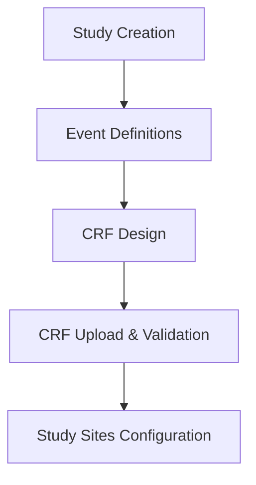

# Build Study Tutorial

Welcome to the Build Study page of OpenClinica! This page is designed to help you learn how to build and configure your Study by following an educational, step-by-step approach. 

The lessons listed will guide you through the process of setting up a practice Study. Once you have finished each lesson, check "Mark Complete" then click the "Save" button. 

* To start a lesson, select the "Create" icon. You can always select the "Create" icon to add a new component to your practice Study.
* Select the "Edit" icon to edit the values for a lesson.
* Select the "View" icon to view the specified values for that lesson.

## Study Configuration Workflow

## Step-by-Step Instructions

### Step 1: Study Creation
Create a new study by defining the study name, protocol ID, and principal investigator details.

### Step 2: Event Definitions
Define the visits or data collection events for your study, such as Baseline, Week 1, and End of Study.

### Step 3: CRF Design
Design your Case Report Forms (CRFs) using standard clinical layouts. You can start with our pre-configured template.
- **[Download Sample Excel CRF Template](sample_crf_template.xlsx)**

### Step 4: CRF Upload & Validation
Upload your prepared Excel CRF. The system will automatically validate the template structure and map the fields to your study variables.

### Step 5: Study Sites Configuration
Add participating clinical sites and associate them with your study to allow investigators to begin data entry.
