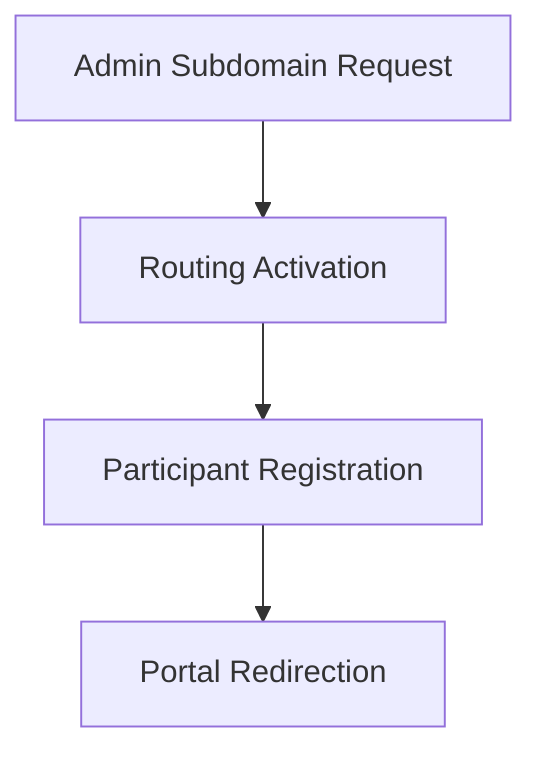

# Participate Setup

To initiate your request to add Participate, please provide a subdomain for this study. This subdomain will be an important part of the URL that participants will use throughout the study.

For example, if your study is called "The JUNO Diabetes Study," you might choose a subdomain such as: "juno" (e.g.  https://juno.mystudy.me)

## Subdomain Configuration & Participant Routing

## Setup Guide

### 1. Admin Subdomain Request
Log into the administration panel and choose a subdomain that matches your study name. Keep it short and memorable.

### 2. Routing Activation
Once requested, the system will validate the subdomain availability and provision the routing rules. This usually takes a few minutes.

### 3. Participant Registration
Participants will receive invitations with the subdomain link. They follow the link to register their accounts.

### 4. Portal Redirection
Upon successful registration, participants are automatically redirected to their personalized portal where they can view study information and complete assigned forms.
