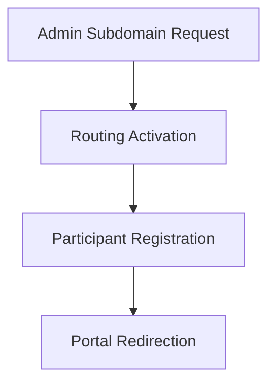

# Tutorial: Setting Up Participant Access

Welcome to the Participate setup tutorial. This guide will teach you how to configure participant access for your study. By following these steps, you will learn how to enroll a participant and grant them the ability to complete electronic patient-reported outcomes directly on their own devices.

For example, if your study is called "The Heart Health Trial," you might choose a subdomain such as: "hearthealth" (e.g.  https://hearthealth.mystudy.me)

## Subdomain Configuration & Participant Routing

## Setup Guide

### Step 1: Enable Participate for the Study (Admin Subdomain Request)

Before enrolling individuals, you must enable the participant portal for your study environment. Log into the administration panel and choose a subdomain that matches your study name. Keep it short and memorable.

1. Navigate to the **Study Settings** menu.
2. Select the **Participate Configuration** tab.
3. Toggle the switch labeled **Enable Participate Access** to the "On" position.
4. You will be prompted to enter a subdomain for your portal. Enter a unique, memorable identifier (for example, "hearthealth" or another generic term). 
5. Click **Save Configuration**. The system will take a few moments to provision your new portal. Once requested, the system will validate the subdomain availability and provision the routing rules.

### Step 2: Configure Notification Settings

Participants receive automated alerts when they need to provide data. You will now configure these alerts.

1. While still in the **Participate Configuration** area, click on the **Notifications** sub-tab.
2. Locate the **Welcome Message** section.
3. Update the subject line to read: "Welcome to the Clinical Study."
4. Ensure the **Email Delivery** and **SMS Delivery** checkboxes are selected.
5. Click **Save Notifications** at the bottom of the screen.

### Step 3: Enroll a Test Participant (Participant Registration)

Now that the portal is active, you will create a test record to see how enrollment works. Participants will receive invitations with the subdomain link. They follow the link to register their accounts.

1. Go to the main dashboard and click on the **Participant Matrix** or **Subject Roster**.
2. Click the **Add Participant** button.
3. Enter a generic Participant ID, such as "TRIAL-001".
4. Fill in a mock email address (e.g., test.participant@example.com) in the contact information section.
5. Select the **Invite to Participate** checkbox. This action triggers the system to send the welcome message you configured in the previous step.
6. Click **Enroll**.

### Step 4: Portal Redirection

Upon successful registration, participants are automatically redirected to their personalized portal where they can view study information and complete assigned forms.

## Conclusion

You have successfully activated the participate module, configured communication settings, and enrolled a test participant. You are now prepared to manage real participant access in your clinical trials.
