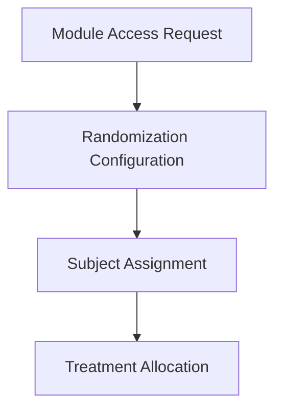

# Tutorial: Configuring Randomization

Welcome to the Randomize setup tutorial. In this guide, you will learn how to establish a randomization scheme for a practice study. Completing this walkthrough will equip you with the knowledge needed to assign subjects to different treatment arms automatically.

OpenClinica Randomize is a separate module for randomizing your patients. Click Request Access and we will contact you to discuss Randomize and your requirements.

## Randomization Workflow

## Configuration Steps

### Step 1: Module Access Request

Initiate the request for the Randomize module from your study settings. Our support team will review and enable it for your environment.

### Step 2: Define Treatment Arms (Randomization Configuration)

The first step in any randomization setup is establishing the different groups or arms to which subjects will be assigned. Set up allocation ratios according to your clinical protocol.

1. Open your study dashboard and navigate to the **Randomization** menu.
2. Click on the **Treatment Arms** section.
3. Click the **Add Arm** button.
4. Enter "Treatment Group A" in the Name field and set the allocation ratio to 1.
5. Click **Save Arm**.
6. Repeat the process to create a second arm named "Placebo Group B" with an allocation ratio of 1.

### Step 3: Set Up Stratification Factors

Stratification ensures that your treatment arms are balanced across key demographic or clinical variables.

1. Navigate to the **Stratification** tab within the Randomization menu.
2. Click **Add Stratification Factor**.
3. In the Factor Name field, type "Age Category".
4. Define two strata by clicking **Add Level**:
   - Level 1: "Under 50"
   - Level 2: "50 and Over"
5. Click **Save Factor** to lock in your stratification settings.

### Step 4: Upload the Randomization List

The system requires a sequence list to determine how upcoming participants will be assigned based on your defined arms and factors. Upload your randomization list according to your clinical protocol.

1. Go to the **Sequence List** tab.
2. Click the **Generate Mock List** button to have the system create a sample file based on your treatment arms and stratification factors.
3. Download the generated CSV file and review it on your computer to understand its structure.
4. Click the **Upload List** button and select the CSV file you just downloaded.
5. The system will validate the file. Once you see the green "Validation Successful" message, click **Confirm Upload**.

### Step 5: Perform a Test Randomization (Subject Assignment)

When a subject becomes eligible, an authorized user clicks the randomize button within the participant's event page. To ensure everything works smoothly, you will run a test assignment.

1. Navigate to your **Participant Matrix**.
2. Select a test participant record (or create a new one).
3. Open the **Randomize Participant** form.
4. Select the appropriate age category for the participant.
5. Click **Execute Randomization**. The system will immediately display the assigned treatment arm.

### Step 6: Treatment Allocation

The system assigns the next available treatment arm based on the uploaded randomization list and records the allocation in the audit log.

## Conclusion

You have successfully defined treatment arms, added a stratification factor, uploaded a sequence list, and performed a test assignment. You can apply these principles to set up robust, randomized trials in the future.
