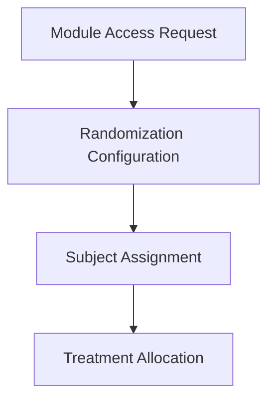

# Randomize Setup

OpenClinica Randomize is a separate module for randomizing your patients. Click Request Access and we will contact you to discuss Randomize and your requirements.

## Randomization Workflow

## Configuration Steps

### 1. Module Access Request
Initiate the request for the Randomize module from your study settings. Our support team will review and enable it for your environment.

### 2. Randomization Configuration
Upload your randomization list, define stratification factors, and set up allocation ratios according to your clinical protocol.

### 3. Subject Assignment
When a subject becomes eligible, an authorized user clicks the randomize button within the participant's event page.

### 4. Treatment Allocation
The system assigns the next available treatment arm based on the uploaded randomization list and records the allocation in the audit log.
